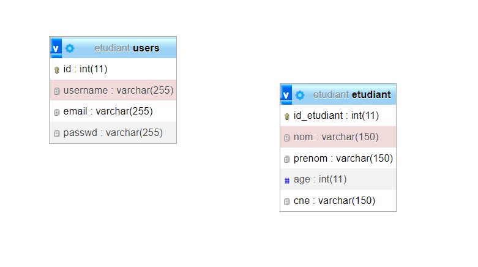
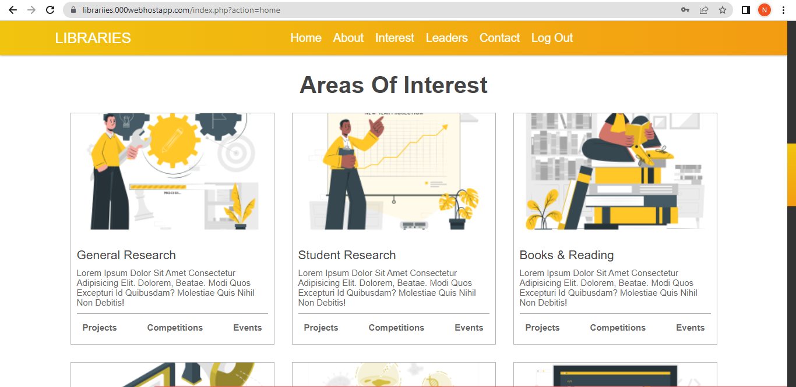
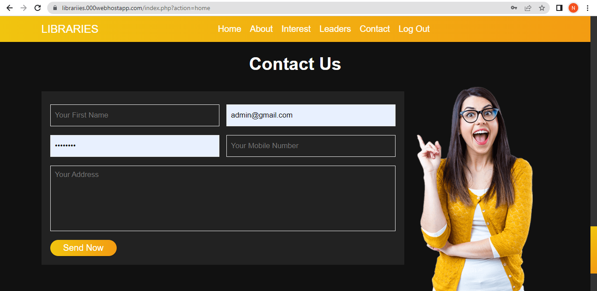
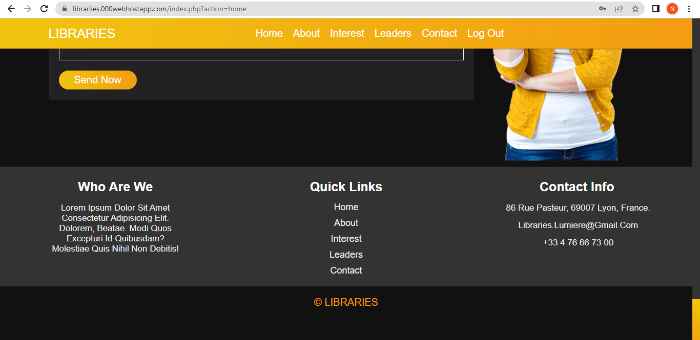
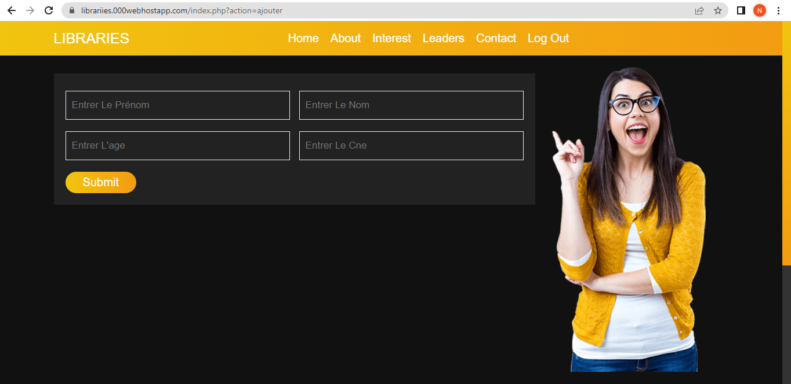
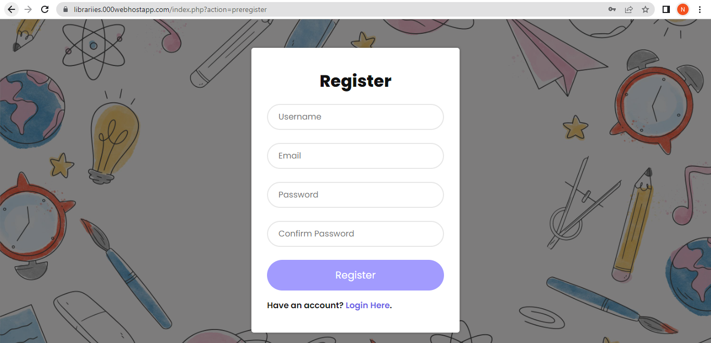
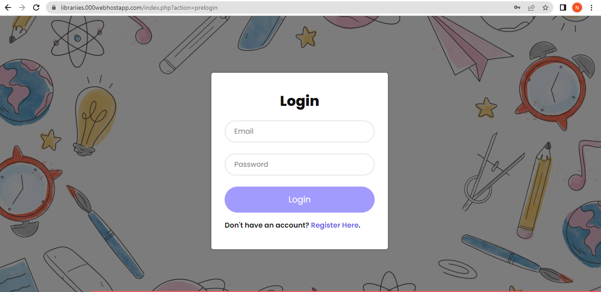
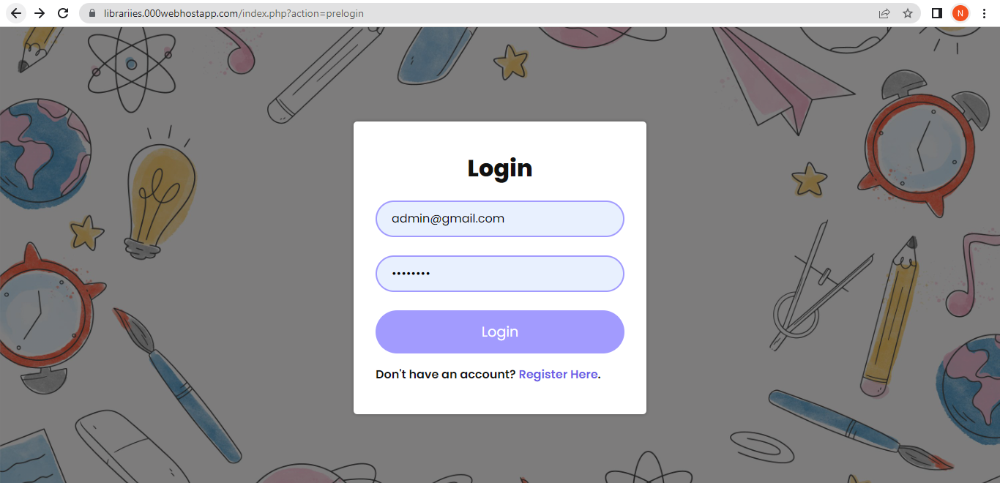
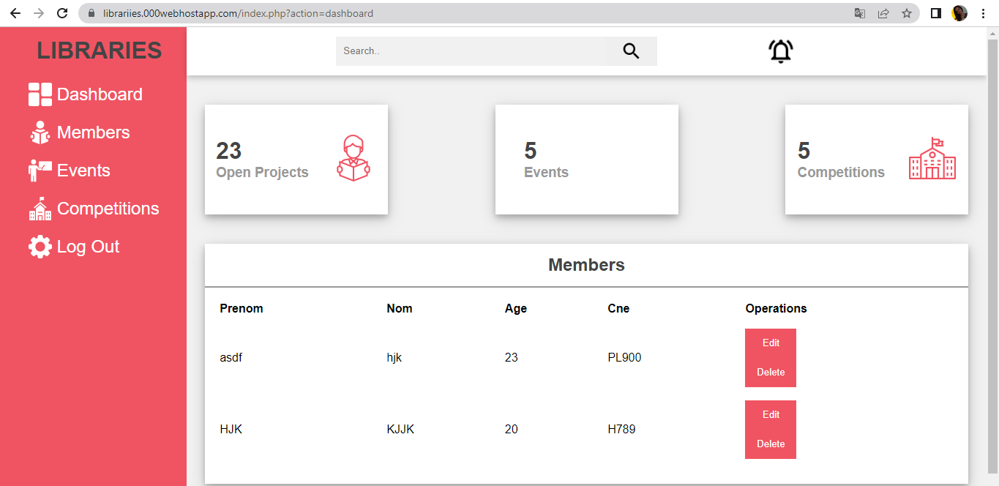
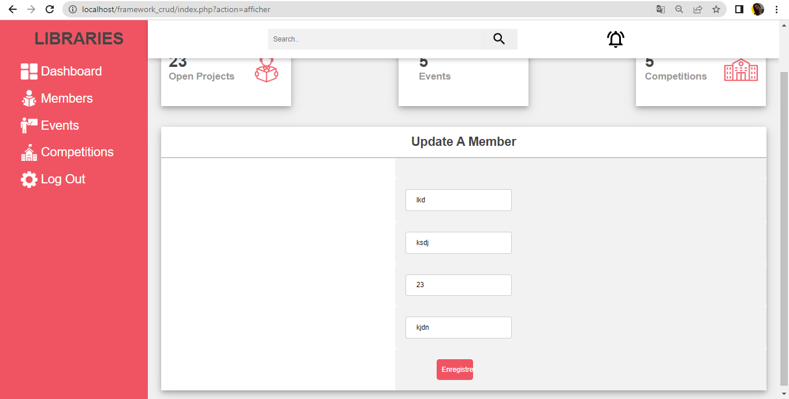

# CRUD Framework

## How to run the project

To run the project, you need the following tools on your local machine: Web Server (e.g., Apache), PHP (Interpreter).
The following tutorial shows how to set up Xampp and php : https://www.geeksforgeeks.org/how-to-run-php-programs

Once you started the Apache Web Server and MySQL on XAMPP, open phpmyAdmin the administration tool for Mysql : http://localhost/phpmyadmin/ and create a database named "etudiant".
The database  should contain two tables :  

  A table named 'etudiant', that has 5 columns; id_etudiant, nom, prenom, age and cne.  
  Second table 'users', that has 4 columns; id, username, email, and passwd.

  Add the admin row to the users table :
  
  
  And lastly you need to make sure that the project folder is located under the XAMPP/htdocs folder on your local machine.
  Paste the following url in your browser and the project should run : http://localhost/framework_crud/index.php
  
  ### *Project architecture* :
  

## Overview
### *Home page*

### *Adding a student's page (Registering as a member)*

### *Register page*

### *Login page*

## Admin

### *Admin Dashboard*

### *Update a member's page*

